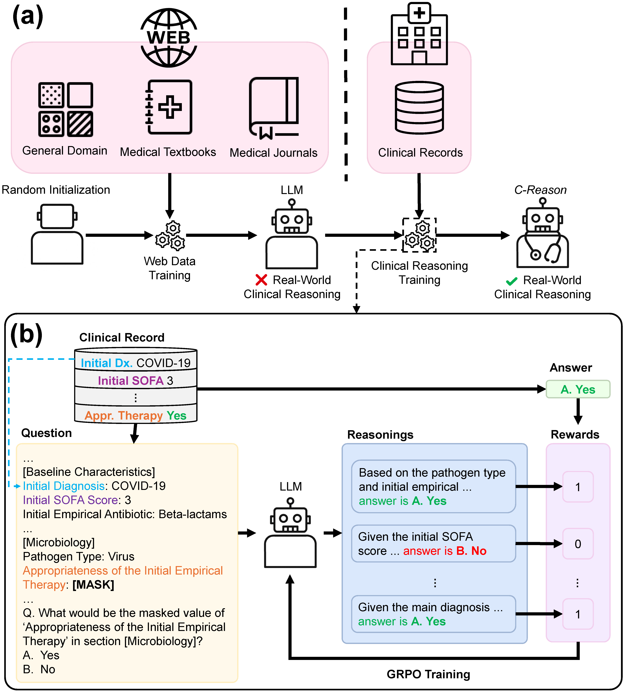

# C-Reason

- Official Implementation of the paper:

  Enhancing LLMs' Clinical Reasoning with Real-World Data from a Nationwide Sepsis Registry [[arxiv](http://arxiv.org/abs/2505.02722)]

> **TL;DR** We propose enhancing the clinical reasoning capabilities of large language models (LLMs) by leveraging real-world clinical records. 
By training on a sepsis registry, we developed \mname, which showed improved reasoning performance not only on the sepsis registry itself but also across other datasets.



# Reproduction
- The training data comes from the sepsis registry, which is private, along with additional private datasets from the hospitalized cohort and stroke registry.
- We are currently discussing the potential release of the model.
- Of all the data used, only the MIMIC-III dataset (see Section 3.2) is publicly available.

<details>
<summary> Setup </summary>

- We use devcontainer for reproducibility.
- Modify `.devcontainer/.env` to set environment variables.
- Build the devcontainer using vscode or using [devcontainer CLI](https://github.com/devcontainers/cli)
</details>

<details>
<summary> Sepsis Registry </summary>

- NOTE: This dataset is private.
- Preprocessing
    - ```python scripts/sepsis_preprocessing.py --metadata_path {METADATA_PATH} --data_path {DATA_PATH} --kor_to_eng_dict_path {KOR_TO_ENG_DICT_PATH} --output_path {OUTPUT_PATH}```
- Training
    - ```accelerate launch --config_file config/deepspeed.json main.py +launcher=grpo +dataset@dataset.grpo=grpo model_path=microsoft/phi-4 debug=false datset.grpo.data_path={OUTPUT_PATH}```

- Evaluation
    - ```python main.py +launcher=evaluate debug=false +dataset@dataset.grpo=grpo dataset.grpo.data_path={OUTPUT_PATH} model_path={MODEL_PATH}  dataset.sepsis_registry.all_victims=true dataset.sepsis_registry.num_eval_samples=99999999```
</details>


<details>
<summary> MIMIC-III </summary>

- Setup
    - ```git submodule init && git submodule update```
    - ```cd ehr_postgres && python --mimic_iii {MIMIC_III_PATH}```
    - ```cd ../mimic_sepsis && python preprocess.py && python sepsis_cohort.py --process_raw && cd ..```
- Measurement Prediction Preprocessing
    - ```python scripts/mimic_all_victims.py --data_path mimic_sepsis/sepsis_final_data_RAW_withTimes.csv --output_path {OUTPUT_PATH}```
- Mortality Prediction Preprocessing
    - ```python scripts/mimic_mort.py --data_path mimic_sepsis/sepsis_final_data_RAW_withTimes.csv --mimic_path {MIMIC_III_PATH} --output_path {OUTPUT_PATH}```
- Evaluation
    - ```python main.py +launcher=evaluate debug=false +dataset@dataset.grpo=grpo dataset.cache_dir={OUTPUT_PATH} model_path={MODEL_PATH}```
</details>


<details>
<summary> Hospitalized Cohort </summary>

- NOTE: This dataset is private.
- Preprocessing
    - ```python scripts/aki_preprocessing.py --data_path {DATA_PATH} --missing_path {MISSING_PATH} --metadata_path {METADATA_PATH} --feature_path {FEATURE_PATH} --output_path {OUTPUT_PATH}```
    - ```python scripts/aki_prediction.py --data_path {OUTPUT_PATH} --original_path {DATA_PATH} --output_path {PRED_PATH}```

- Evaluation
    - Denoising: ```python main.py +launcher=evaluate debug=false +dataset@dataset.aki_registry=aki_registry dataset.aki_registry.data_path={OUTPUT_PATH} model_path={MODEL_PATH} dataset.aki_registry.all_victims=true dataset.aki_registry.num_eval_samples=99999999```
    - AKI Prediction: ```python main.py +launcher=evaluate debug=false +dataset@dataset.aki_registry=aki_registry dataset.aki_registry.cache_dir={PRED_PATH} model_path={MODEL_PATH}```
</details>

<details>
<summary> Stroke Registry </summary>

- NOTE: This dataset is private.
- Preprocessing
    - ```python scripts/stroke_preprocessing.py --metadata_path {METADATA_PATH} --data_path {DATA_PATH} --nihss_path {NIHSS_PATH} --additional_path {ADDITIONAL_PATH} --kor_to_eng_dict_path {KOR_TO_ENG_DICT_PATH} --output_path {OUTPUT_PATH}```
    - ```python scripts/stroke_mrs3mo.py --input_path {OUTPUT_PATH} --output_path {PRED_PATH}```
- Evaluation
    - Denoising: ```python main.py +launcher=evaluate debug=false +dataset@dataset.stroke_registry=stroke_registry dataset.stroke_registry.data_path={OUTPUT_PATH} model_path={MODEL_PATH} dataset.stroke_registry.all_victims=true dataset.stroke_registry.num_eval_samples=99999999```
    - Prediction: ```python main.py +launcher=evaluate debug=false +dataset@dataset.stroke_registry=stroke_registry dataset.stroke_registry.cache_dir={PRED_PATH} model_path={MODEL_PATH}```
</details>


# Citation
```
@misc{kim2025enhancingllmsclinicalreasoning,
      title={Enhancing LLMs' Clinical Reasoning with Real-World Data from a Nationwide Sepsis Registry}, 
      author={Junu Kim and Chaeeun Shim and Sungjin Park and Su Yeon Lee and Gee Young Suh and Chae-Man Lim and Seong Jin Choi and Song Mi Moon and Kyoung-Ho Song and Eu Suk Kim and Hong Bin Kim and Sejoong Kim and Chami Im and Dong-Wan Kang and Yong Soo Kim and Hee-Joon Bae and Sung Yoon Lim and Han-Gil Jeong and Edward Choi},
      year={2025},
      eprint={2505.02722},
      archivePrefix={arXiv},
      primaryClass={cs.AI},
      url={https://arxiv.org/abs/2505.02722}, 
}
```
